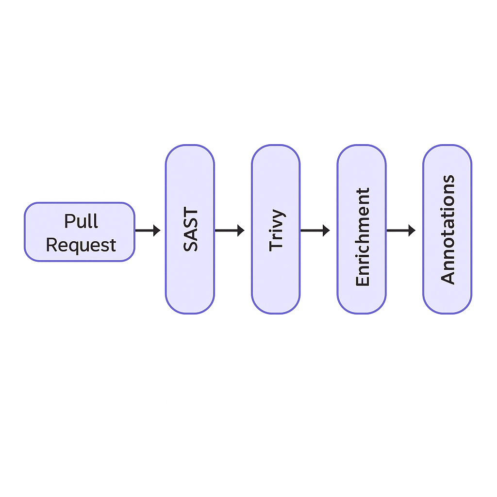

# 🔐 Secure SDLC & DevSecOps Pipeline 
(Under construction) 

## 📌 Overview
This project implements a fully automated Secure Software Development Lifecycle (SDLC) pipeline using GitHub Actions, integrating security testing tools for source, dependency, and runtime analysis. It enables early vulnerability detection, developer-friendly feedback, and supply chain integrity.

## 🛠️ Tech Stack
- **GitHub Actions** – CI/CD pipeline
- **SAST** – Semgrep, SonarQube
- **DAST** – OWASP ZAP, Burp Suite
- **Container Scanning** – Trivy
- **Supply Chain Security** – SBOM (Syft), SLSA compliance
- **Alert Enrichment** – CWE tagging, severity classification, remediation tips

## 🏗️ DevSecOps CI/CD Architecture

  

- PR triggers pipeline
- Semgrep + SonarQube perform static scans
- ZAP performs DAST against a live URL
- Trivy scans Docker image layers for CVEs
- SBOM is generated via Syft
- Findings are enriched with CWE + Fix guidance
- Results are annotated on PR and stored as artifacts

## 🧪 Features
- ✅ Automated static and dynamic scans on every pull request
- ✅ Trivy-based scanning of Docker images for CVEs
- ✅ SBOM generation for audit trails and third-party license verification
- ✅ Enrichment engine with CWE + severity + fix suggestion
- ✅ Developer triage via GitHub PR annotations and summary artifacts

## 📂 Repository Structure
- `.github/workflows/` – CI/CD YAMLs for each tool
- `configs/` – Semgrep and SonarQube rules
- `scripts/` – Custom enrichment & alerting helpers
- `docs/` – Architecture and workflow diagrams

## 🚀 Getting Started
1. Clone this repository
2. Enable GitHub Actions
3. Configure tool secrets and endpoints (ZAP, SonarQube)
4. Push a test PR and view annotations + reports

## 📜 Compliance
- ✅ SLSA Level 2: Provenance tracking via SBOM
- ✅ CWE + CVSS tags for dev visibility
- ✅ Reusable pipeline templates for enterprise DevSecOps adoption

## 👤 Author
**Kamalesh Jayapandiaraj**  
🔗 [LinkedIn](https://www.linkedin.com/in/kamalesh-jayapandiaraj-arumugam/)  
📫 [Email](karumuga@usc.edu)

